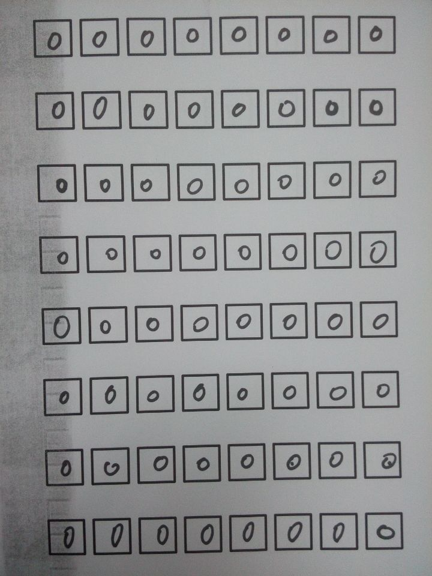
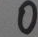
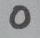
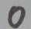
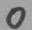

##README

This is a tool which helps to build handwrite digit dataset like MNIST.

It can extract image patch(figure.2 ) from many printing forms(figure. 1), and build a 10 class dataset with labels.

If you want a README of English version, please let me know.

这是一个方便自制手写数字数据集的工具。它可以：抽取 『手写数字方格纸』（如figure.1） 的格子内图像，并自动生测试集（如figure.2）和数据集标签 testLabel.txt
  

figure. 1

figure. 2

##Usage
0. 打印、用手写数字填满『方格纸』:box_mid_size.pdf（每张只写一种数字），并扫描。

1. 编译附录的程序    
 
2. 进入本目录   
	>cd handwrite_dataset_generator

3. 新建文件夹：执行命令，程序自动生成1_form，2_boxes，3_cropped，4_dataset等文件夹
	>python 1_gen_work_dir.py

4. 扫描出的图像，分类放入其中1_form文件夹中（手写数字1的『方格纸』放入 1_form/1 文件夹中，以此类推）。

5. *nix系统下执行，或者手动执行6 7步
	>./0_run_all.sh

6. Linux系统下执行  （Windows下请参考这个.sh改写）
	>./2_run_preprocess.sh   
  
	程序自动把图片方格字块提取出来，存到3_cropped文件夹中。请人工检查3_cropped中的0 1 2 3...文件夹内的数字图像与文件名相符

7. 生成手写数字数据集  
	> python 3_gen_digit_data_label.py
	
	
8. 得到程序自动生成的数据集，在4_dataset文件夹中。请确认有生成了：许多000xx.tiff格式的手写字体图像和一个testLabel.txt标签文件。标签文件每行记录对应序号的数字图像的label。

  ---
## 附录

如果您的系统不是OSX 10.9 请自行更改每个工具目录下的 CMakeLists.txt
三个可能用到的程序，使用前需要安装Cmake，OpenCV 2，到**每个工具目录下**运行命令编译，然后就可以使用了

> cmake . ; make;

####  BoxExtraction   

提取『方格纸』srcImg的方格内图像到 dstDir  
> ./BoxExtraction/main srcImgPath dstDir

#### CutEdge 

去图像srcPath的边框，保存到destPath（最后参数是图片缩小百分比）
> ./CutEdge/main srcImgPath destImgPath 0.2
	 
#### DisplayImage
测试您的OpenCV能否正常运行
> ./DisplayImage/main srcImgPath